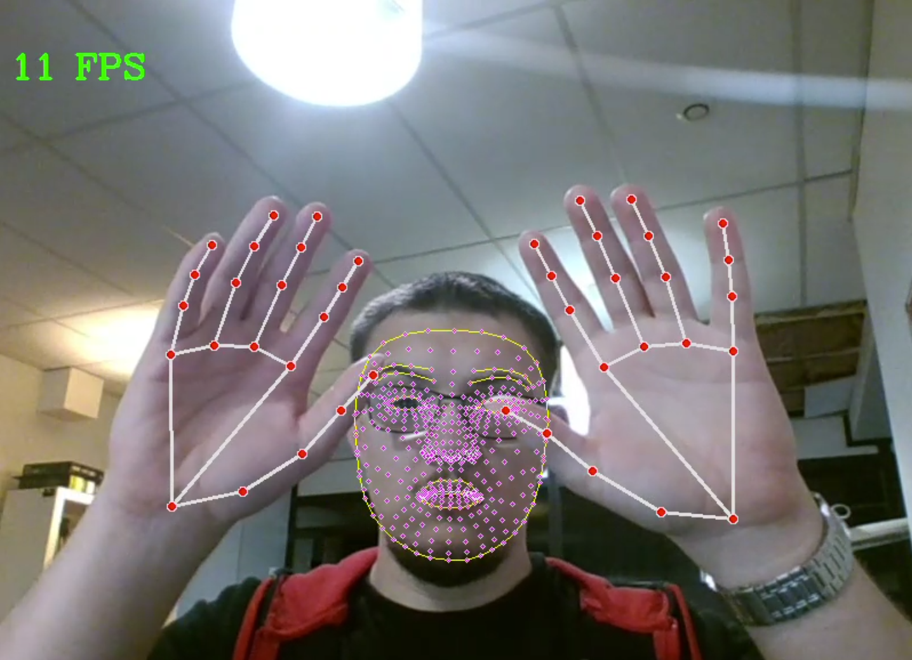

# mediapipe-experimentations

This repository is used to make some experiments with mediapipe, for body recognition using [Mediapipe](https://ai.google.dev/edge/mediapipe/solutions/guide?hl=fr) 

*This project implements the head + hands recognition and the fullbody recognition.*

## How to run this project ?

### Using your own python interpreter

1. Get [Python 3](https://www.python.org/downloads/)
2. Run the [start.bat](start.bat) file. It will download requirements and load successively the two programs.